Here is the comprehensive architectural system map for the **livecount** application and its corresponding libraries:

# Livecount Ecosystem: Architectural System Map

## 1. Executive Summary
The **Livecount** ecosystem in `mepworkspace` is an Angular-based platform for construction takeoff and estimation. It supports:
- **2D Graphical Takeoff (2D Canvas/Drawings)**: Taking physical dimensions from drawings with AI-assisted features.
- **3D Quantity Takeoff (QTO)**: Visualizing 3D BIM models via Trimble Connect and processing high-performance material and structural takeoffs.
- **Embedded Client Viewports**: Operates seamlessly as an embedded context (WebView2 or Iframe) communicating bidirectionally with host estimators (Anywhere, Classic/CM) using `postMessage` or SignalR hubs.

---

## 2. Main Applications (`apps/`)

### 1. `livecount` (Main Production Client App)
* **Path**: `apps/livecount`
* **Type**: Modular Angular Application (`AppModule`)
* **Role**: Primary application container. Manages core routing, auth guards, licensing, and orchestrates lazy-loaded domains from `libs/livecount/` and `libs/shared/`.
* **State**: Uses NgRx with state persistence via custom `localStorageSync` meta-reducers.

### 2. `livecount-studio` (Developer Test Bench)
* **Path**: `apps/livecount-studio`
* **Type**: Lightweight Angular Application
* **Role**: Simulates host environments. Embeds `livecount` in an iframe, allowing developers to inspect postMessage payloads, mock host events, view client schemas, and trigger data migration tasks.

---

## 3. Domain Libraries Architecture (`libs/livecount/`)

Livecount is structured into distinct modules following Nx DDD (Domain-Driven Design) conventions:

| Library Path | Aliased Import Path | Layer Type | Description & Purpose |
| :--- | :--- | :--- | :--- |
| `connect-viewer/feature` | `@hcworkspace/livecount/connect-viewer/feature` | Feature | Interfaces directly with Trimble Connect's 3D viewer API inside the viewport. |
| `graphical-takeoff/feature` | `@hcworkspace/livecount/graphical-takeoff/feature` | Feature | Orchestrates 2D canvas drawing takeoffs, tool toggles, and drawing tools. |
| `jobs/data-access` | `@hcworkspace/livecount/jobs/data-access` | Data Access | NgRx actions, effects, reducers, and selectors for Livecount jobs. |
| `jobs/feature` | `@hcworkspace/livecount/jobs/feature` | Feature | Job overview dashboards, DevExtreme-backed grids, and job resolvers. |
| `message/api` | `@hcworkspace/livecount/message/api` | API | Defines messaging contracts between the client and host interfaces. |
| `message/data-access` | `@hcworkspace/livecount/message/data-access` | Data Access | Protocol provider orchestrating iframe postMessage, Webview2, and SignalR. |
| `models/api` | `@hcworkspace/livecount/models/api` | API | Export definitions and interfaces for 3D model resources. |
| `models/data-access` | `@hcworkspace/livecount/models/data-access` | Data Access | State management for adding, updating, and syncing 3D files. |
| `models/feature` | `@hcworkspace/livecount/models/feature` | Feature | UI components for model management, version control, and selection trees. |
| `models/model` | `@hcworkspace/livecount/models/model` | Model | Core model structures, conversions, and tree-node data models. |
| `projects/data-access` | `@hcworkspace/livecount/projects/data-access` | Data Access | Project domain state, effects, and selectors. |
| `projects/feature` | `@hcworkspace/livecount/projects/feature` | Feature | View components for selecting and managing projects/estimates. |
| `quantity-takeoff/api` | `@hcworkspace/livecount/quantity-takeoff/api` | API | Public contracts for physical 3D takeoffs. |
| `quantity-takeoff/data-access`| `@hcworkspace/livecount/quantity-takeoff/data-access` | Data Access | Coordinates OPFS (file storage), Web Workers, and state management. |
| `quantity-takeoff/feature` | `@hcworkspace/livecount/quantity-takeoff/feature` | Feature | QTO component orchestrator, complex element grids, and calculators. |
| `quantity-takeoff/model` | `@hcworkspace/livecount/quantity-takeoff/model` | Model | Core physical definitions (IFC classes, standard structures, properties). |
| `quantity-takeoff/ui` | `@hcworkspace/livecount/quantity-takeoff/ui` | UI | Presentational widgets (property modifiers, custom inputs, dialogs). |
| `quantity-takeoff-signalr/data-access`| `@hcworkspace/livecount/quantity-takeoff-signalr/data-access`| Data Access | Real-time BIM element takeoff syncing via SignalR. |
| `signalr/data-access` | `@hcworkspace/livecount/signalr/data-access` | Data Access | Generic real-time SignalR hub wrappers and store effects. |
| `utilities/routing` | `@hcworkspace/livecount/utilities/routing` | Utilities | Defines centralized route constant pathways (`ROUTE_PATHS`). |

---

## 4. Key Architectural Patterns

1. **Environment-Aware Protocol Wrapper (`LcMessageProtocolProvider`)**
   - Automatically detects current runtime context (Standalone Browser, Chrome/Edge WebView2, or Embedded Iframe).
   - Resolves communication mechanics dynamically: switches seamlessly between standard window message events (`window.parent.postMessage`) and backend-driven SignalR connections.

2. **High-Performance BIM Processing**
   - **OPFS (Origin Private File System)**: Caches large, physical 3D models locally in a high-speed sandboxed browser filesystem.
   - **Background Web Workers**: Decoupled parsing (`data-processor.worker.ts`) offloads processing-heavy data processing from the main browser UI thread.

3. **Complex Grids & State Coordination**
   - Leverages **DevExtreme Data Grids** tied directly to **NgRx store states** to enable performant, Excel-like cell validations, inline property edits, and dynamic calculations.

---

## 5. Visual System Map

```mermaid
graph TD
    classDef appClass fill:#2d3748,stroke:#4a5568,stroke-width:2px,color:#fff;
    classDef libClass fill:#1a365d,stroke:#2b6cb0,stroke-width:1.5px,color:#fff;
    classDef sharedClass fill:#2c5282,stroke:#3182ce,stroke-width:1px,color:#fff;
    classDef extClass fill:#1c3d1f,stroke:#2f855a,stroke-width:1px,color:#fff;

    %% Main Apps
    subgraph APPS [Applications]
        LC[apps/livecount]:::appClass
        LCS[apps/livecount-studio]:::appClass
    end

    %% Bidirectional Embedding
    LCS -- "Embeds & mocks postMessage" --> LC

    %% Livecount Feature Libraries
    subgraph LIVECOUNT_LIBS [Livecount Domain Libraries]
        LC_Routing[utilities/routing]:::libClass
        LC_Msg[message/data-access]:::libClass
        LC_SigR[signalr/data-access]:::libClass
        
        LC_JobsF[jobs/feature]:::libClass
        LC_JobsD[jobs/data-access]:::libClass
        
        LC_ProjF[projects/feature]:::libClass
        LC_ProjD[projects/data-access]:::libClass
        
        LC_ModelsF[models/feature]:::libClass
        LC_ModelsD[models/data-access]:::libClass
        LC_ModelsM[models/model]:::libClass
        
        LC_GTF[graphical-takeoff/feature]:::libClass
        
        LC_QTOF[quantity-takeoff/feature]:::libClass
        LC_QTOD[quantity-takeoff/data-access]:::libClass
        LC_QTOM[quantity-takeoff/model]:::libClass
        LC_QTOU[quantity-takeoff/ui]:::libClass
        LC_QTOSigR[quantity-takeoff-signalr/data-access]:::libClass
        
        LC_CV[connect-viewer/feature]:::libClass
    end

    %% Relationships Inside Domain
    LC --> LC_Routing
    LC --> LC_Msg
    LC --> LC_JobsF
    LC --> LC_ProjF
    LC --> LC_ModelsF
    LC --> LC_GTF
    LC --> LC_QTOF
    
    LC_JobsF --> LC_JobsD
    LC_ProjF --> LC_ProjD
    LC_ModelsF --> LC_ModelsD
    LC_ModelsD --> LC_ModelsM
    
    LC_QTOF --> LC_QTOD
    LC_QTOF --> LC_QTOU
    LC_QTOD --> LC_QTOM
    LC_QTOF --> LC_CV
    LC_QTOD -- "Uses SignalR sync" --> LC_QTOSigR
    LC_QTOSigR --> LC_SigR
    
    %% External Integrations
    subgraph EXTERNAL [External & Host APIs]
        TC_Viewer[Trimble Connect 3D Viewer]:::extClass
        BE_API[Backend APIs & Hubs]:::extClass
    end
    
    LC_CV -- "Workspace API / iframe" --> TC_Viewer
    LC_Msg -- "SignalR Connection" --> BE_API
    LC_QTOD -- "OPFS & Web Workers" --> LC_QTOD

    %% Shared Libraries Dependencies
    subgraph SHARED_LIBS [Core Shared Libraries]
        SH_Auth[shared/platform/mep-authenticate]:::sharedClass
        SH_Lic[shared/platform/mep-license]:::sharedClass
        SH_Draw[shared/estimating/drawings]:::sharedClass
        SH_Annot[shared/estimating/annotations]:::sharedClass
        SH_UI[shared/user-interface]:::sharedClass
    end

    LC --> SH_Auth
    LC --> SH_Lic
    LC_JobsF --> SH_Draw
    LC_GTF --> SH_Annot
    LC_QTOF --> SH_Annot
    LC_QTOF --> SH_UI
```

---

## Appendix: livecount Resolved Dependency Closure

Full, code-resolved list (from real `@hcworkspace/*` imports, not name-guessing or LLM summarization) - 136 lib(s):

- App: `apps/livecount`
- `libs/shared/estimating/annotations/tokens`
- `libs/shared/estimating/autocount/tokens`
- `libs/shared/estimating/drawings/tokens`
- `libs/shared/estimating/drawing-compare/tokens`
- `libs/shared/estimating/estimates/tokens`
- `libs/shared/estimating/symbol-points/tokens`
- `libs/shared/platform/terms-of-service/tokens`
- `libs/shared/application-settings/tokens`
- `libs/livecount/quantity-takeoff/tokens`
- `libs/shared/platform/mep-authenticate/tokens`
- `libs/shared/platform/mep-license/tokens`
- `libs/shared/estimating/content/assembly-library/tokens`
- `libs/shared/estimating/schedules/tokens`
- `libs/shared/content/list-management/tokens`
- `libs/livecount/jobs/feature`
- `libs/livecount/models/feature`
- `libs/livecount/projects/feature`
- `libs/livecount/quantity-takeoff/feature`
- `libs/livecount/utilities/routing`
- `libs/shared/platform/mep-authenticate/feature`
- `libs/shared/application/navigation/model`
- `libs/shared/estimating/attachments/feature`
- `libs/shared/estimating/drawings/feature`
- `libs/shared/estimating/estimates/feature`
- `libs/shared/legacy/utils-common`
- `libs/shared/platform/mep-license/feature`
- `libs/shared/platform/projects/feature`
- `libs/shared/utilities/routing`
- `libs/livecount/message/data-access`
- `libs/shared/platform/mep-authenticate/data-access`
- `libs/shared/application-settings/data-access`
- `libs/shared/application/navigation/data-access`
- `libs/shared/estimating/estimates/data-access`
- `libs/shared/feature-flags/api`
- `libs/shared/platform/gainsight/util`
- `libs/shared/platform/logrocket/data-access`
- `libs/shared/platform/projects/data-access`
- `libs/shared/platform/projects/model`
- `libs/shared/feature-flags/model`
- `libs/livecount/connect-viewer/feature`
- `libs/livecount/jobs/data-access`
- `libs/livecount/models/data-access`
- `libs/livecount/projects/data-access`
- `libs/livecount/quantity-takeoff-signalr/data-access`
- `libs/livecount/quantity-takeoff/data-access`
- `libs/shared/platform/mep-authenticate/api`
- `libs/shared/platform/mep-chat-bot/data-access`
- `libs/shared/platform/mep-chat-bot/feature`
- `libs/shared/platform/mep-email/data-access`
- `libs/shared/application/guard/data-access`
- `libs/shared/application/login-orchestration/data-access`
- `libs/shared/application/navigation/feature`
- `libs/shared/application/network/feature`
- `libs/shared/content/list-management/model`
- `libs/shared/estimating/annotation-layers/data-access`
- `libs/shared/estimating/annotation-layers/feature`
- `libs/shared/estimating/annotation-styles/feature`
- `libs/shared/estimating/annotations/data-access`
- `libs/shared/estimating/annotations/feature`
- `libs/shared/estimating/autocount/data-access`
- `libs/shared/estimating/autocount/feature`
- `libs/shared/estimating/drawing-compare/data-access`
- `libs/shared/estimating/drawing-scales/data-access`
- `libs/shared/estimating/drawing-scales/feature`
- `libs/shared/estimating/drawing-views/data-access`
- `libs/shared/estimating/drawings/data-access`
- `libs/shared/estimating/graphical-takeoff/api`
- `libs/shared/estimating/graphical-takeoff/data-access`
- `libs/shared/estimating/graphical-takeoff/feature`
- `libs/shared/estimating/grid-views/data-access`
- `libs/shared/estimating/grid-views/feature`
- `libs/shared/estimating/industries/api`
- `libs/shared/estimating/industries/model`
- `libs/shared/estimating/measurements/api`
- `libs/shared/estimating/schedules/data-access`
- `libs/shared/estimating/user-company-settings/api`
- `libs/shared/estimating/user-company-settings/data-access`
- `libs/shared/feature-flags/data-access`
- `libs/shared/legacy/ui`
- `libs/shared/platform/application-settings-group/data-access`
- `libs/shared/platform/mep-license/api`
- `libs/shared/platform/mep-license/data-access`
- `libs/shared/platform/terms-of-service/data-access`
- `libs/shared/platform/tokens`
- `libs/shared/platform/user-settings/data-access`
- `libs/shared/user-interface/mep-spinner`
- `libs/shared/user-profile/api`
- `libs/shared/utilities/logger`
- `libs/data-models/estimate-models`
- `libs/shared/platform/mep-license/model`
- `libs/shared/estimating/annotation-styles/data-access`
- `libs/shared/estimating/symbol-points/data-access`
- `libs/livecount/message/api`
- `libs/shared/estimating/drawings/api`
- `libs/livecount/models/model`
- `libs/shared/estimating/estimates/model`
- `libs/shared/estimating/annotations/model`
- `libs/shared/estimating/grid-views/model`
- `libs/shared/estimating/drawings/model`
- `libs/shared/estimating/annotation-layers/model`
- `libs/shared/estimating/drawing-scales/model`
- `libs/shared/estimating/user-company-settings/model`
- `libs/shared/estimating/symbol-points/model`
- `libs/shared/estimating/estimates/api`
- `libs/shared/platform/projects/api`
- `libs/shared/platform/terms-of-service/api/index`
- `libs/shared/user-interface/mep-dialog`
- `libs/shared/estimating/industries/data-access`
- `libs/shared/utilities/transloco`
- `libs/shared/user-interface/breadcrumb-data`
- `libs/shared/application-settings/api`
- `libs/shared/platform/projects/utilities/connect-folder-name-validator`
- `libs/shared/user-interface/mep-grid`
- `libs/shared/user-interface/mep-infographic`
- `libs/shared/platform/project-files/feature`
- `libs/shared/user-interface/mep-progress-dialog`
- `libs/livecount/quantity-takeoff/model`
- `libs/shared/user-interface/mep-toolbar`
- `libs/shared/user-interface/mep-toast`
- `libs/shared/platform/project-files/util`
- `libs/livecount/quantity-takeoff/ui`
- `libs/shared/estimating/drawing-compare/feature`
- `libs/shared/estimating/graphical-takeoff-main/feature`
- `libs/shared/user-interface/mep-chips`
- `libs/shared/user-interface/mep-dynamic-form`
- `libs/shared/user-interface/toggle-button`
- `libs/shared/utilities/svg-loader`
- `libs/livecount/models/api`
- `libs/shared/estimating/annotations/api`
- `libs/shared/estimating/annotations/util`
- `libs/shared/estimating/grid-views/api`
- `libs/shared/utilities/web-storage`
- `libs/livecount/signalr/data-access`
- `libs/livecount/message/tokens`
- `libs/shared/estimating/annotation-styles/model`
- `libs/livecount/quantity-takeoff/api`
